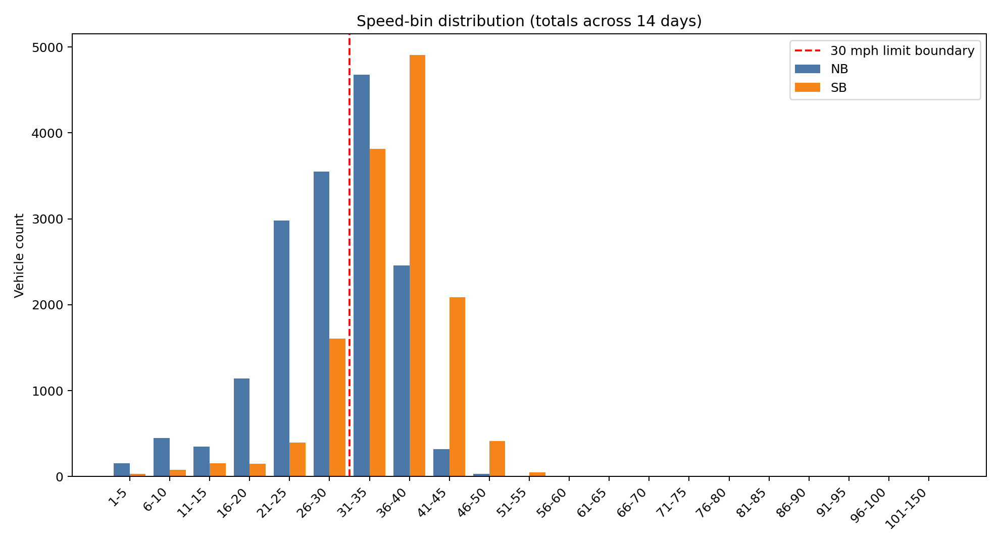
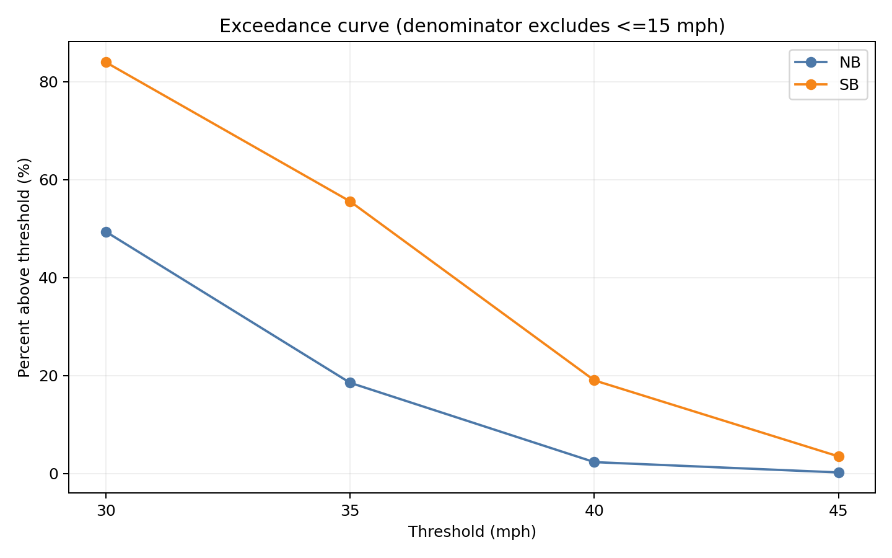
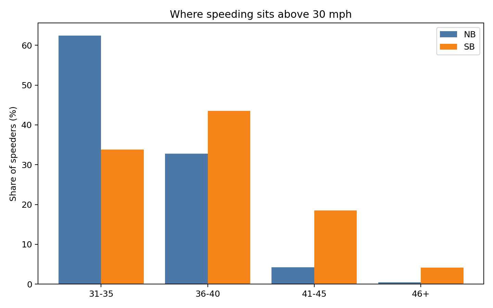
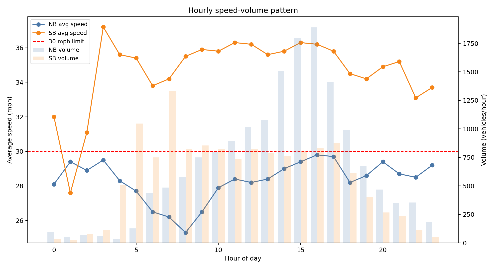

# SR229 @ Vine Speed Analysis (NB + SB)

Data source:
- `C:\Users\chris\Downloads\229@Vine NB Speed Report.pdf` (2026-01-20 to 2026-02-02)
- `C:\Users\chris\Downloads\SR229@Vine SB Speed Report.pdf` (2026-02-05 to 2026-02-19)

I extracted the speed-bin totals and hourly summary values from the report tables, then analyzed speeding with a low-speed filter to reduce driveway/turning effects.

## Method (showing work)

### 1) Speed bins used
Both reports use 5 mph bins:
`1-5, 6-10, 11-15, 16-20, 21-25, 26-30, 31-35, 36-40, 41-45, 46-50, 51-55, 56-60, 61-65, 66-70, 71-75, 76-80, 81-85, 86-90, 91-95, 96-100, 101-150`

Totals from the reports:

| Direction | Total vehicles | 1-5 | 6-10 | 11-15 | 16-20 | 21-25 | 26-30 | 31-35 | 36-40 | 41-45 | 46+ |
|---|---:|---:|---:|---:|---:|---:|---:|---:|---:|---:|---:|
| NB | 16,108 | 154 | 446 | 348 | 1,139 | 2,981 | 3,549 | 4,679 | 2,457 | 320 | 35 |
| SB | 13,689 | 31 | 80 | 152 | 147 | 393 | 1,608 | 3,814 | 4,908 | 2,086 | 470 |

(`46+` aggregates 46-50 through 101-150.)

### 2) Speeding definition and low-speed discount
- Speed limit = **30 mph**
- Speeding = **strictly greater than 30 mph** (bins `31+`)
- Primary low-speed discount: exclude **<=15 mph** from denominator

Primary formula:

`Pct over 30 (filtered) = Count(speed > 30) / Count(speed > 15)`

Example calculations:
- NB speeding count = `4679 + 2457 + 320 + 29 + 6 = 7491`
- NB filtered denominator (`>15`) = `16108 - (154 + 446 + 348) = 15160`
- NB filtered speeding rate = `7491 / 15160 = 49.41%`

- SB speeding count = `3814 + 4908 + 2086 + 414 + 48 + 7 + 1 = 11278`
- SB filtered denominator (`>15`) = `13689 - (31 + 80 + 152) = 13426`
- SB filtered speeding rate = `11278 / 13426 = 84.00%`

## Key results

### Over-30 mph (primary filtered result: exclude <=15 mph)
- **NB:** `49.41%` (7,491 of 15,160)
- **SB:** `84.00%` (11,278 of 13,426)
- **Combined:** `65.66%` (18,769 of 28,586)

### Sensitivity to low-speed cutoff
Even with stricter filtering, the direction gap is persistent:

| Direction | Raw over 30 | Exclude <=10 mph | Exclude <=15 mph | Exclude <=20 mph |
|---|---:|---:|---:|---:|
| NB | 46.50% | 48.30% | 49.41% | 53.43% |
| SB | 82.39% | 83.06% | 84.00% | 84.93% |

## Non-obvious patterns

1. **Very strong directional asymmetry**
   - SB over-limit share is much higher than NB across every cutoff.
   - Using the filtered primary result, the **odds** of speeding in SB are about **5.38x** NB.

2. **SB is not just “slightly faster,” it has a heavier high-speed tail**
   - Among speeders (>30 mph), severity mix:
     - NB: `31-35` = 62.46%, `36-40` = 32.80%, `41-45` = 4.27%, `46+` = 0.47%
     - SB: `31-35` = 33.82%, `36-40` = 43.52%, `41-45` = 18.50%, `46+` = 4.17%
   - SB has a much larger share of 41+ mph behavior, not just borderline speeding.

3. **Low-speed contamination is modest, especially in SB**
   - Removed by <=15 filter:
     - NB: 948 vehicles (5.89% of all NB)
     - SB: 263 vehicles (1.92% of all SB)
   - This means high SB speeding is not an artifact of driveway-turning low-speed data.

4. **Hourly pattern suggests speed-volume coupling differs by direction**
   - Correlation of hourly average speed vs hourly volume:
     - NB: `+0.225` (weak positive)
     - SB: `+0.547` (moderate positive)
   - SB maintains high average speeds even at substantial daytime volumes, suggesting persistent geometric/behavioral influence rather than only low-traffic speeding.

## Graphics

### 1) Speed distribution by bin

### 2) Exceedance curve (filtered denominator excludes <=15 mph)

### 3) Speeding severity mix (>30 mph only)

### 4) Hourly speed and volume pattern

## Reported-summary context from source PDFs
- NB summary page: average speed `28.55`, 85th percentile `35.55`, total volume `16,108`
- SB summary page: average speed `35.35`, 85th percentile `40.83`, total volume `13,689`

These summary values align with the bin-based findings above and reinforce that SB is systematically and materially faster.
